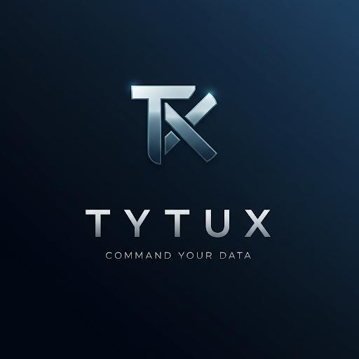

# 🚀 TyTuX - Command Your Data



TyTuX is an interactive assistant powered by **MCP** and **Gemini AI**. It enables users to interact with the **New Relic GraphQL API** through a conversational interface.

---

## ✨ Features
- 🔗 **Connects to MCP servers** using `npx`.
- 🤖 **Integrates with Gemini AI** for generating intelligent responses.
- 🛠️ **Supports tool invocation** and interaction during conversations.
- 🧠 **Maintains conversation history** for context-aware responses.

---

## 📋 Requirements
- 🐍 **Python**: Version 3.12 or higher
- 🟢 **Node.js**: With `npx` installed
- 🔑 A `.env` file with the following environment variables:
  - `GEMINI_API_KEY`: [Your Gemini API key] [https://ai.google.dev/gemini-api/docs](https://aistudio.google.com/apikey)
  - `NEW_RELIC_USER_API_KEY`: Your New Relic User API key.
  - `NEW_RELIC_API_ENDPOINT` (optional): Defaults to `https://api.newrelic.com/graphql`.
  - `NEW_RELIC_ACCOUNT_ID`: Your new relic account id.
  - `ALLOW_MUTATIONS` (optional): Defaults to `false`.

---

## ⚙️ Setup Instructions

### 1️⃣ Clone the Repository
```bash
git clone https://github.com/dpacheconr/tytux
cd tytux
```

### 2️⃣ Create a Virtual Environment
```bash
python3 -m venv venv
source venv/bin/activate
```

### 3️⃣ Install Dependencies
```bash
pip install --upgrade pip
pip install -r requirements.txt
```

### 4️⃣ Configure Environment Variables
```bash
cp .env-example .env
```

### 5️⃣ Run the Script
```bash
python3 client.py
```

---

## 💡 Example Prompts

Here are some example prompts to get started:

1. **Set up account ID and inspect schema**:
   - _"Use account ID `YOUR_ACCOUNT_ID_HERE` for ongoing queries. Inspect the NerdGraph API schema when no query is provided."_

2. **Get all alerts and suggest improvements**:
   - _"Get all alerts using `nrqlConditionsSearch`. Include total count, NRQL condition query, and ID in the results. Suggest improvements, such as adding `WHERE` clauses to each NRQL query where appropriate."_

---

## 📖 Additional Resources
- [New Relic GraphQL API Documentation](https://docs.newrelic.com/docs/apis/nerdgraph/get-started/introduction-new-relic-nerdgraph/)
- [Gemini AI Documentation](https://ai.google.dev/gemini-api/docs)

---
